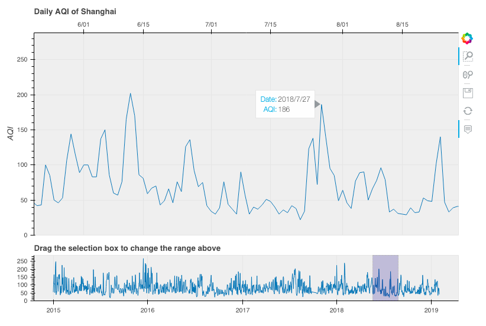

## Time series data visualization using Bokeh

#### 1. Hourly PM2.5 of Shanghai
:small_blue_diamond: **click [`here`](https://casey0808.github.io/aqi_shanghai/pm25_sh.html) for the interactive version**
&nbsp;

#### 2. Daily AQI of Shanghai
:small_blue_diamond: **click [`here`](https://casey0808.github.io/aqi_shanghai/aqi_sh.html) for the interactive version**
&nbsp;

----
data source : 
* [U.S. Department of State Air Quality Monitoring Program](http://www.stateair.net/web/historical/1/4.html)  
`State Air observational data are not fully verified or validated; these data are subject to change, error, and correction.  The data and information are in no way official.`
* [Shanghai Environmental Monitoring Center](http://semc.gov.cn/aqi/Home/historyData)
